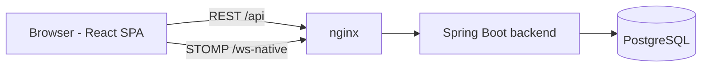

<div align="center">

# 🃏 OpenPoker

**Open-source planning poker for agile teams, and soon for AI agents too.**

[](https://github.com/arsova-mx/OpenPoker/actions/workflows/ci.yml)
[](LICENSE)


</div>

OpenPoker is a self-hostable, real-time planning poker app. Create a room, share the code, and let your team estimate together: votes stay hidden until the host reveals them, and OpenPoker shows the average, the level of consensus and the outliers, so the conversation goes straight to the disagreements.

> **Project status:** pre-release (v0.3), heading to an MVP launch. See the [open issues](https://github.com/arsova-mx/OpenPoker/issues) and [milestones](https://github.com/arsova-mx/OpenPoker/milestones). The UI is currently in Spanish; English i18n is planned.

## ✨ Features

- **Real-time rooms** over WebSocket (STOMP). Participants, votes and reveals sync instantly.
- **Multiple estimation decks:** Fibonacci, T-Shirt sizes and Dot Voting, including the `?` and `☕` wildcards.
- **Backlog per session:** add tickets and estimate them one by one.
- **Hidden votes, simultaneous reveal.** Only the host can reveal or start a new round.
- **Reveal statistics:** average, consensus percentage, full-consensus highlight, outliers and a suggested card.
- **Round timer**, configurable by the host.
- **Ticket comments** for discussion.
- **Guest access** (partial): the backend supports joining without an account, and the UI flow is in progress ([#51](https://github.com/arsova-mx/OpenPoker/issues/51)).

### On the roadmap
- **Session history:** sessions you hosted or joined, with final estimates and every voting round ([#40](https://github.com/arsova-mx/OpenPoker/issues/40)).
- **OpenPoker for AI agents:** agents that join a session, vote with a written rationale and help refine the backlog, via an MCP server. Read the [vision document](docs/VISION.md) and the epic [#68](https://github.com/arsova-mx/OpenPoker/issues/68).

## 🚀 Quick start (Docker)

**Requirements:** Docker with Compose v2.

```bash
git clone https://github.com/arsova-mx/OpenPoker.git
cd OpenPoker
cp .env.example .env
```

Edit `.env` and set at least these values:

```bash
POSTGRES_PASSWORD=<a strong password>
JWT_SECRET=<output of: openssl rand -base64 48>
```

Then start everything:

```bash
docker compose up --build
```

| Service | URL |
|---|---|
| Web app | http://localhost:3000 |
| REST API | http://localhost:8080/api |

The frontend container (nginx) proxies `/api` and `/ws-native` to the backend, so the browser only talks to one origin.

## 🛠️ Local development

**Requirements:** Java 21, Node.js 22+, and PostgreSQL 15+.

The quickest way to get a local database is a throwaway container that matches the backend defaults:

```bash
docker run -d --name openpoker-pg -p 5432:5432 \
  -e POSTGRES_DB=openpoker -e POSTGRES_USER=openpoker -e POSTGRES_PASSWORD=openpoker \
  postgres:17-alpine
```

### Backend (Spring Boot)

```bash
cd backend
export JWT_SECRET="$(openssl rand -base64 48)"
./mvnw spring-boot:run
```

It connects to `localhost:5432/openpoker` as `openpoker`/`openpoker` by default; override with the `SPRING_DATASOURCE_*` variables below.

On startup the backend applies the database migrations (Flyway, see [docs/database.md](docs/database.md)) and seeds the three estimation decks. Add `SPRING_PROFILES_ACTIVE=dev` to log the SQL.

### Frontend (React + Vite)

```bash
cd frontend
npm ci
npm run dev
```

The dev server runs on http://localhost:3000 and proxies `/api`, `/ws` and `/ws-native` to `http://localhost:8080`.

### Configuration

| Variable | Used by | Default | Description |
|---|---|---|---|
| `JWT_SECRET` | backend | *(required)* | HS256 signing key, at least 32 bytes. Generate it with `openssl rand -base64 48`. **Never reuse a secret from git history.** |
| `JWT_EXPIRATION_MS` | backend | `3600000` | Token lifetime (1 hour) |
| `SPRING_DATASOURCE_HOST` / `_PORT` / `_NAME` | backend | `localhost` / `5432` / `openpoker` | PostgreSQL connection |
| `SPRING_DATASOURCE_USERNAME` / `_PASSWORD` | backend | `openpoker` / `openpoker` | PostgreSQL credentials (defaults are for local development only) |
| `SERVER_PORT` | backend | `8080` | HTTP port |
| `ALLOWED_ORIGINS` | backend | `http://localhost:3000,http://127.0.0.1:3000,http://localhost:5173` (compose: `http://localhost:${FRONTEND_PORT}`) | Comma-separated browser origins allowed to call the API and open the WebSocket (CORS). Patterns such as `https://*.pages.dev` are supported. Same-origin requests are always allowed. **Set it to your public frontend URL in production.** |
| `VITE_API_URL` | frontend (build time) | `/api` | Base URL of the REST API. Keep it relative when frontend and backend share an origin. |
| `POSTGRES_DB`, `POSTGRES_USER`, `POSTGRES_PASSWORD` | docker compose | see `.env.example` | Database container |
| `BACKEND_PORT`, `FRONTEND_PORT` | docker compose | `8080`, `3000` | Published ports |

### Tests and checks

```bash
cd backend && ./mvnw verify                  # unit and integration tests (H2)
cd frontend && npm run lint && npm run build # lint, type-check and build
```

CI runs these on every pull request, plus a Docker Compose smoke test.

## 🧱 Architecture



| Layer | Technology |
|---|---|
| Backend | Java 21, Spring Boot 4, Spring Security + JWT, Spring WebSocket (STOMP), Spring Data JPA |
| Frontend | React 18, Vite 5, TypeScript, Tailwind CSS 4, shadcn/ui, Zustand, `@stomp/stompjs` |
| Database | PostgreSQL 17 |
| Infrastructure | Docker Compose, nginx |

```
OpenPoker/
├── backend/src/main/java/com/openpoker/
│   ├── config/           # WebSocket, async, data seeding
│   ├── controller/       # REST controllers and STOMP handlers
│   ├── dto/              # Request/response records
│   ├── entity/           # JPA entities
│   ├── globalexception/  # Domain exceptions and handler
│   ├── repository/       # Spring Data repositories
│   ├── security/         # JWT, Spring Security, STOMP auth
│   └── service/          # Business logic
├── frontend/src/
│   ├── api/              # Axios client and API services
│   ├── components/       # UI components (shadcn/ui in components/ui)
│   ├── hooks/            # useStompClient, useVoting, ...
│   ├── pages/  routes/   # Pages and React Router config
│   ├── store/            # Zustand stores
│   └── types/            # Shared TypeScript types
├── docs/                 # API reference, database/migrations and vision
└── docker-compose.yml
```

The REST and WebSocket contract is documented in **[docs/api.md](docs/api.md)**, and the database schema and migrations in **[docs/database.md](docs/database.md)**.

## 🤝 Contributing

Contributions are welcome.

- Browse issues labeled [`good first issue`](https://github.com/arsova-mx/OpenPoker/labels/good%20first%20issue) or pick something from the current milestone.
- Issues are labeled by area (`area:backend`, `area:frontend`, `area:infra`) and priority (`priority:P0` to `P2`).
- Work on a branch and open a pull request that links its issue (`Closes #123`). CI must pass.
- Prefer [Conventional Commits](https://www.conventionalcommits.org/) for PR titles (`feat:`, `fix:`, `docs:`...).

A full `CONTRIBUTING.md` and code of conduct are coming in [#60](https://github.com/arsova-mx/OpenPoker/issues/60).

## 🔒 Security

Please **don't open public issues for vulnerabilities**. Until a `SECURITY.md` with a private reporting channel is published ([#59](https://github.com/arsova-mx/OpenPoker/issues/59)), contact the maintainers of [@arsova-mx](https://github.com/arsova-mx) directly.

## 📄 License

[MIT](LICENSE) © Arsova and the OpenPoker contributors.
