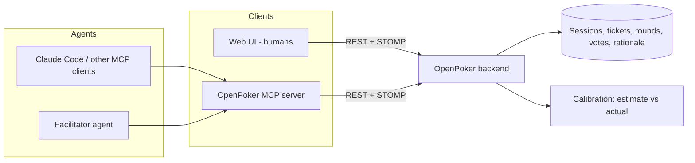

# OpenPoker Vision: agile ceremonies for humans and AI agents

> **Status:** draft design document. Nothing here is implemented yet.
> Tracking epic: [#68](https://github.com/arsova-mx/OpenPoker/issues/68).

## TL;DR

OpenPoker starts as an open-source planning poker tool for agile teams. The long-term goal is to become an **open framework for agentic agility**: the place where human teams and AI agents run agile ceremonies together (estimation, refinement, sprint planning) with shared rules, transparent reasoning and measurable outcomes.

The core bet is that planning poker's mechanics, *estimate independently, reveal together, discuss the divergence*, suit multi-agent systems at least as well as they suit humans.

---

## 1. Why planning poker fits AI agents

Planning poker exists to fight two failure modes of group estimation. Both show up in multi-agent LLM systems.

| Failure mode | In human teams | In multi-agent systems | What poker already does |
|---|---|---|---|
| **Anchoring** | The loudest or most senior person speaks first and everyone converges on their number | An agent that sees another agent's answer tends to agree with it | Votes stay hidden until a simultaneous **reveal** |
| **False consensus** | Disagreement is smoothed over to finish the meeting | Averaging several model outputs hides the one that spotted a real risk | **Divergence triggers discussion.** A `13` among `3`s says the ticket is ambiguous or risky |

A few more properties make it a good fit:

- **It's structured.** It has a small, well-defined protocol (join, vote, reveal, discuss, re-vote, finalize) that agents can follow reliably.
- **It produces data.** Every round records independent estimates, and once work is done they can be compared with the actual effort. That is a natural calibration signal for both people and agents.
- **Humans stay in control.** A human host decides when to reveal, when to re-vote and what the final estimate is.

## 2. Usage modes

### Mode 1: Agent as a teammate
An agent joins a regular human session as a participant. It reads the ticket (and optionally repository context), votes **with a written rationale**, and takes part in the discussion. Humans see it as another voter, marked as an agent.

> *The team estimates "Add GitHub login". The `backend-agent` votes 8: "the users table has no provider column, a migration is needed, and the JWT filter assumes username/password".*

### Mode 2: Agent-only ceremonies with human approval
A facilitator agent runs a ceremony with specialist agents (backend, frontend, QA, security) over a batch of tickets, for example refining 30 GitHub issues overnight. The output is a proposal with estimates, the rationale for each, and a list of the tickets with the widest divergence. A human reviews and approves it.

### Mode 3: Humans estimating agent-executed work
When the backlog will be executed by coding agents, the team estimates different dimensions: effort for the agent, risk, and **how much human supervision** the ticket needs (autonomous, pair, or human-only).

## 3. Architecture sketch

### 3.1 Participants
Today a participant is either a registered **user** or a **guest**. The plan is to add a third type:

| Type | Identity | Auth | Notes |
|---|---|---|---|
| `USER` | Account | JWT (login) | Exists today |
| `GUEST` | Display name, session-scoped | Guest token (planned, [#50](https://github.com/arsova-mx/OpenPoker/issues/50)) | Exists today (partially) |
| `AGENT` | Agent name + version, owned by a user or org | Service token, scoped to a session or org | New |

Agents are always visibly marked as agents in the UI, and are owned by an accountable human or organization.

### 3.2 Votes with rationale
- Votes gain an optional `rationale` field, **mandatory for agents**.
- Rationale stays hidden until reveal, like the vote itself, so it can't anchor anyone.
- The existing per-ticket comments become the discussion thread after each reveal.

### 3.3 Rounds are first-class
Every reveal closes a **round**. Re-votes open a new round instead of deleting the previous one. This groundwork is already planned in [#40](https://github.com/arsova-mx/OpenPoker/issues/40), and it's what makes calibration and auditability possible.

### 3.4 MCP server
An OpenPoker [Model Context Protocol](https://modelcontextprotocol.io) server lets any MCP-capable agent take part without custom integration. Draft tool surface:

| Tool | Purpose |
|---|---|
| `join_session(code, agent_name)` | Join as an `AGENT` participant |
| `list_tickets(code)` | Read the backlog of the session |
| `get_ticket(ticket_id)` | Title, description, comments, previous rounds |
| `cast_vote(ticket_id, card, rationale)` | Vote in the current round |
| `get_results(ticket_id)` | Revealed votes, rationale and statistics |
| `comment(ticket_id, text)` | Take part in the discussion |

The MCP server is a thin client of the public REST/STOMP API. Agents get no privileges that humans don't have.

### 3.5 Calibration
- Import tickets from trackers ([#30](https://github.com/arsova-mx/OpenPoker/issues/30) for GitHub Issues) and later pull actual outcomes (cycle time, PR size, reopen rate).
- Track estimate-vs-actual per participant, per agent and **per agent version**.
- Surface the results as feedback ("this agent underestimates frontend tickets by ~40%"), not as rankings of people.

### 3.6 Agent versions and org-level policies (idea under evaluation)
Organizations will want to pin which agent version joins their ceremonies, and to try a new version on a subset first (canary). One candidate design is a generic policy table:

| Column | Example |
|---|---|
| `policy_key` | `agent_version.canary.estimator-backend` |
| `scope_type` + `scope_ref` | `ORGANIZATION` / `TEAM` / `SESSION` + id |
| `value` | `{"version": 2}` |
| `schema_id` + `schema_version` | Versioned JSON schema the value is validated against |

Seeds are idempotent (insert-if-absent). Combined with calibration data, this lets an organization promote a canary agent version only when it estimates better than the current one.

## 4. Principles

1. **Human in the loop by default.** Agents propose, and humans decide the final estimate.
2. **Transparency.** Agents are always labeled, and their rationale is visible after reveal.
3. **Independence before discussion.** Nobody, human or agent, sees other votes before the reveal.
4. **Open protocol.** Everything an agent can do goes through the same public API humans use.
5. **Data minimization.** Agents see only what the session exposes. No personal data of participants.

## 5. Roadmap

| Phase | Scope | Status |
|---|---|---|
| **0: MVP groundwork** | Session history, rounds kept instead of deleted, final estimate per ticket ([#40](https://github.com/arsova-mx/OpenPoker/issues/40)), security hardening | In progress |
| **1: Agent participant** | `AGENT` participant type, service tokens, vote rationale, UI badge | Planned |
| **2: MCP server** | Tool surface above, published as a package | Planned |
| **3: More ceremonies** | INVEST check before estimating, sprint planning with capacity, retrospectives | Idea |
| **4: Calibration** | Estimate vs actual, per-agent-version metrics, canary policies | Idea |

## 6. Launch strategy

1. **Human MVP (soft launch):** GitHub, agile and developer communities (English and Spanish), to get real users and feedback.
2. **Public launch (Product Hunt and similar):** once phases 1 and 2 exist. *"Open-source planning poker where your AI agents estimate alongside your team"* is the differentiator in a crowded category.

## 7. Open questions

- What estimation units make sense for Mode 3 (agent effort, supervision level, risk)? Are they separate decks?
- How much repository context should an agent get by default, and who grants it?
- Should agents see human comments from previous rounds before re-voting?
- Pricing and hosting model for a managed instance, if any, while keeping the project fully open source.

Contributions and discussion are welcome in [#68](https://github.com/arsova-mx/OpenPoker/issues/68).
